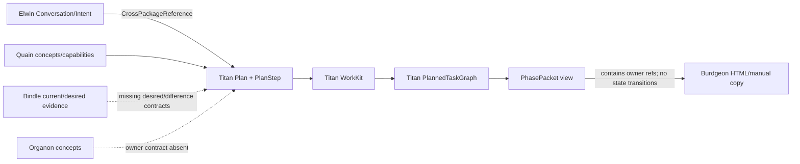
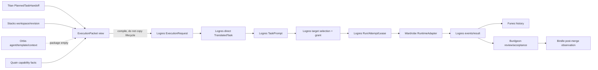

# Phase-delivery loop ownership map

Status: authoritative static reconciliation for MME-3761 at the revisions listed in
[`tests/Fixtures/phase-delivery-loop.v1.json`](../tests/Fixtures/phase-delivery-loop.v1.json).
The fixture is the machine-readable transition register; this document explains how to use it.
The audit read package source, tests, migrations, and documentation. It made no provider calls.

## Rule for later Burdgeon work

Burdgeon composes owner contracts. It must not persist a second planning, workspace, execution,
evidence, or history lifecycle. A Burdgeon record may cache a projection only when it:

1. contains canonical owner identities and immutable snapshots or freshness;
2. can be rebuilt from owner records;
3. never makes Linear status, a path, a machine name, or a provider ticket canonical;
4. delegates every state change to the package named in the transition register; and
5. records unavailable or stale owner data instead of fabricating an empty result.

MME-677 is explicitly excluded. Canonical Stacks identities and revision evidence are sufficient
for this map.

## Package responsibility boundary

| Package | Owns | Does not own |
| --- | --- | --- |
| Elwin | Exact accepted human input; versioned Intent; Conversation and deliberation transitions; Twinkle possibility state; portable handoffs | Planning, execution, provider sessions as identity, or runtime |
| Titan | Plan, PlanStep, planning records, WorkKit, planned-task graph, planning dependency/readiness, planning interrupts, completion proof, execution-candidate projections | Runtime current state, provider dispatch, historical evidence |
| Logres | ExecutionRequest; executable task plan; prompt; target requirements/selection; grant check; Run/Attempt/Lease; provider binding; live event semantics; verification; result; recovery | Provider inventory/auth, runtime adapter implementation, workspace registry, durable history |
| Stacks | Workspace, repository, checkout, path, branch, remote and revision observations; Git/provider read models | Dispatch authority, task state, runtime |
| Orbis | Intended owner of reusable agent manifests, task templates and context-input requirements | Nothing is implemented at the audited revision |
| Quain | Capability manifests, dependencies, vocabulary/concept identity, declared compatibility, deterministic catalogue queries | Dispatch authority or complete candidate compatibility evaluation |
| Wardrobe | Narrow allowlisted runtime/provider adapter invocation and provider acknowledgement callback | Persistence, auth, lifecycle, target selection, retries |
| Funes | Append-only observations, evidence, artifacts, provenance, relationships and historical outcomes | Mutable execution current state or planning readiness |
| Bindle | Current implementation: structural inspection, application scans/captures, composition/render evidence | The required desired-state artifact and canonical Difference contract are not implemented |
| Organon | Intended owner of reusable methodology and technical concepts | No package or contract was discoverable; Quain currently implements `ConceptReference` |
| Linear | Work-item projection only | Canonical planning, execution, review, acceptance, or evidence state |
| Burdgeon | Server-rendered composition, application policy, human decisions, adapters and rebuildable projections | Any replacement registry, scheduler, lease, runner, evidence store, or history |

## Deterministic loop

Every row has the same detailed keys in the fixture: owning package, consumed contract, produced
object/event, persistence owner, authorization check, retry/idempotency boundary, evidence, gap,
source paths, and relevant tests.

| ID | Transition | Owner | Consumes → produces | Persistence | Authorization | Retry/idempotency | Evidence | Gap |
| --- | --- | --- | --- | --- | --- | --- | --- | --- |
| T01 | Accept exact human input | Elwin | `UserInputDraft` → `PrimaryAskUserInput` | Funes-backed `UserInputStore` adapter | Human/submitting actor and delegation attestation | Channel + actor + client submission ID | Exact bytes and attachment refs | — |
| T02 | Interpret intent | Elwin | Accepted input → `InferredIntent`/`UserEditedIntent` | Described Funes adapter | Host authorizes editor | Immutable family versions and supersession | Provenance, constraints, uncertainty | Intent/Conversation persistence port absent |
| T03 | Deliberate and hand off | Elwin | `ConversationEvent` → versioned `Conversation` handoff | Described Funes adapter | Only active Conversation mutates; host actor policy | Explicit version; duplicate identity guard absent | Inputs, intents, messages, events, handoff | Typed Decision Request/readiness handoff absent |
| T04 | Promote possibility | Titan | Elwin Twinkle → `PromotionResult` | Separate owner stores | Host promotion policy | Promotion idempotency key | Exact Twinkle version, context, concepts | — |
| T05 | Author phase plan | Titan | Conversation ref → `Plan`/`PlanStep` | Untyped host adapter | Host plan authority | IDs and replacement lineage | Outcomes, dispositions, criteria | Plan store/version authority absent |
| T06 | Compile WorkKit | Titan | Planning records → `WorkKit` | Host immutable versions | Legal record transitions; host actor policy | Compile identity/supersedes | Scope, dependencies, capabilities, criteria, provenance | — |
| T07 | Compile/evaluate task graph | Titan | WorkKit + facts → `PlannedTaskGraph` readiness | Host + graph version authority | Approvals and interrupts gate planning | Deterministic DAG/version/supersession | Task contracts and completion proofs | Orbis absent; Quain evaluation incomplete |
| T08 | Emit dispatchable work | Titan | Active graph → `PlannedTaskHandoff` | Rebuildable projection | All planning gates must pass | Same graph gives same handoff; stale graph fails | Complete ready-task contract | Titan-to-Logres mapper absent |
| T09 | Materialize requests | Logres + Titan relation | Handoff → accepted `ExecutionRequest` + `PlanMaterialization` | `ExecutionRequestStore` + Titan host | Explicit auth context and validation | Stable request identity; correction/child lineage | Caller intent and deliberation origin | Field mapper absent |
| T10 | Create executable plan | Logres | Request → `TaskPlan`/`TranslatedTask` | `TaskPlanStore` | `TaskStartAuthority` plus readiness | Stable IDs and re-plan lineage | Outputs, acceptance evidence, dependencies | Must use one-to-one direct mapping, not re-decompose |
| T11 | Compile prompt | Logres | Resolved context/task → `TaskPrompt` | `TaskPromptStore` | Permissions freeze after source auth | Input/compiler hash and immutable versions | Exact bytes and provenance hashes | Orbis source contracts absent |
| T12 | Resolve workspace/revision | Stacks | Registry/discovery → workspace and provenance snapshots | Stacks registry; Logres snapshot store | Logres later grants authority | Canonical normalization/reconciliation | IDs, remote, checkout, path, branch, revision, freshness | Worktree/revision value types absent |
| T13 | Resolve capabilities | Quain | Manifests → ordered compatibility facts | Canonical manifest source | Catalogue is not dispatch authority | ID/version/contract version and DAG order | Ports, dependencies, constraints, exit criteria | Cross-domain evaluator absent; `dep-quain` is empty |
| T14 | Select target | Logres | Requirements + observed candidates → selection | `ExecutionTargetStore` | Per-candidate explicit authorization | Deterministic order; exactly one auto-selection | Candidate rejection reasons and snapshot | Provider recommendation not typed separately |
| T15 | Approve dispatch | Logres | Run + grant + frozen facts → auth snapshot | Grant authority + `RunStore` | Full actor/target/repo/workspace/runtime/permission check | Changed/stale facts require a new decision | Allowed/denied decision and frozen context | Grant issuer/revoker remains host policy |
| T16 | Create Run/Attempt/Lease | Logres | Authorized provenance → execution current state | `RunStore` + CAS `ExecutionStateStore` | Current Attempt and active Lease token | Local Run first; operation IDs; linked Attempts | Complete immutable provenance and current lineage | — |
| T16A | Reserve/dispatch/bind/reconcile provider invocation | Logres + host adapter | Invocation request → invocation record and bound/reconciling Run | Atomic provider invocation persistence + `RunStore` | Frozen dispatch snapshot must match | Reserve once; never redispatch uncertain work; exact ack/lookup converges | Invocation status, provider binding and lookup result | SDK/auth/lookup adapter remains host-owned |
| T17 | Accept runner envelope | Logres | `ExecutionEnvelope` → acceptance/rejection + `RuntimeRequest` | `RunnerLocalStateStore` | Envelope, grant, Stacks, capabilities and lease | Envelope identity and local reservation prevent reinvocation | Acceptance/rejection and runner events | — |
| T17A | Poll and acknowledge outbound lease | Logres + host transport | Poll/ack contracts → lease/no-work and ack result | Canonical `ExecutionStateStore`; no second queue | Runner and Run/Attempt/Lease identities must match | Retry delay; deterministic acknowledgement identity | Offer/no-work reason and ack status | Authenticated transport and concurrent-poll app proof remain |
| T18 | Invoke runtime | Wardrobe | `RuntimeInvocation` → outcome/ack/output | None in Wardrobe | Host allowlists after Logres authorization | No Wardrobe retry; Logres reconciles | Output, stable provider ID, artifact metadata | Invocation uses path; keep Logres wrapper authoritative |
| T18A | Retain/report/reconcile terminal result | Logres | Runner terminal result → receipt and local terminal stage | `RunnerLocalStateStore` + host sink | Immutable Run/Attempt/Lease correlation | Retain before report; redeliver without reinvocation | Terminal result, receipt and local stage | — |
| T19 | Normalize execution events | Logres + Funes history | Provider event envelope → events and observations | Logres event stores + Funes SQL stores | Association checks + historical append auth | Event/append identity dedupe | Raw envelope, normalized event, provenance | Logres-to-Funes adapter absent |
| T20 | Verify and finalize | Logres + Funes history | Events + verification plan → verified outcome/result/terminal state | Result/state stores + historian | Lease gates terminal mutation | Identical terminal replay; no reopening | Checks, pre/postflight, result, evidence refs | Human review/acceptance contract absent |
| T21 | Recover/cancel | Logres | Failure/cancel command → recovery, retry, reconcile or terminal cancel | `ExecutionStateStore` | Lease token and `CancellationAuthorization` | Operation IDs; same Attempt reconciliation; linked retry | Reason, action, lineage, partial result | — |
| T22 | Review, accept and merge | Burdgeon policy + Stacks reads | Exact result/revision/evidence → decision and merge observation | Funes history; Git provider canonical merge | Reviewer and repository authority | Bind decision to exact revision/evidence; provider merge identity | Decision and merged revision | Typed review/acceptance/merge relation absent |
| T23 | Observe post-merge | Bindle + Funes history | Stacks revision → inspection/capture/evidence | Bindle DB + Funes | Local/driver and workspace policy | Distinct snapshot run | Structure, route/component, HTML/screenshot evidence | Desired state and Difference contracts absent |
| T24 | Synchronize/next candidate | Funes + Titan; Burdgeon composition | New observations + active graph → readiness/candidate projection | Owner stores; rebuildable cache | Read policy; new dispatch still needs approval | Funes identity + Titan graph version | Fresh facts and readiness reasons | Synchronization service/candidate projection absent |
| T25 | Project to Linear | Burdgeon adapter | Owner read models → issue/comment/link | Linear projection only | Linear credential scope | Canonical owner ref as adapter key | Source refs and projection time | Adapter/mapping contract absent |

## Packet relation maps

`PhasePacket` and `ExecutionPacket` are names for immutable views, not new aggregates.

### PhasePacket field ownership

| Projection field | Canonical owner/type | Decision |
| --- | --- | --- |
| Packet version/hash | Titan projection | Missing; add only as deterministic projection identity |
| Plan and steps | Titan `Plan`, `PlanStep` | Reference directly |
| Deliberation origin | Elwin `Conversation`; shared reference | Reference exact version/source |
| Architecture/boundaries | Titan `WorkKit`, `ScopeFence` | Reuse |
| Dependencies/readiness | Titan planned-task graph | Reuse; do not calculate in Burdgeon |
| Verification/stop conditions | Titan `PlannedTask` criteria | Reuse |
| Technical concepts | Organon intended; Quain `ConceptReference` implemented | Resolve ownership before introducing packet field |
| Current/desired state | Bindle | Current inspection exists; desired state/Difference are gaps |
| Manual copy/paste | Burdgeon presentation | Render the same projection; no canonical duplicate |

### ExecutionPacket field ownership

| Projection field | Canonical owner/type | Decision |
| --- | --- | --- |
| Planned work and lineage | Titan `PlannedTaskHandoff` | Reference |
| Request and execution task | Logres `ExecutionRequest`, direct `TranslatedTask` | Compile through missing adapter |
| Workspace/repository/revision | Stacks `WorkspaceReference`, `ExecutionProvenance` | Snapshot exact IDs/facts |
| Agent/template/context inputs | Orbis | Blocked: package is empty |
| Capabilities/compatibility | Quain `CapabilityManifest`; Titan required IDs | Reuse IDs/versions; evaluator gap |
| Provider recommendation | Titan execution-candidate projection | Add separately from target selection; contract absent |
| Concrete target | Logres requirements/selection | Reuse |
| Human grant | Logres `ExecutionGrant`/authorization snapshot | Reuse; host issues/revokes |
| Prompt | Logres `TaskPrompt` | Reuse immutable identity/hash |
| Current execution | Logres Run/Attempt/Lease/read models | Link; never copy statuses |
| Runtime invocation | Wardrobe adapter contracts | Invoke only after Logres gate |
| Events/result/evidence | Logres current semantics; Funes history | Link by stable references |
| Linear issue | Burdgeon adapter projection | Never treat issue status as owner state |

## Explicit type, tag, role and relation decisions

- Defer `PhasePacket` as a concrete type. Its eventual home is a Titan read projection with a
  deterministic version/hash, not Logres or a Burdgeon aggregate.
- Defer `ExecutionPacket` as a concrete type. Its eventual home is a Titan execution-candidate
  projection that compiles once into existing Logres objects.
- Reject new planning and execution status tags. Existing Titan and Logres enums are authoritative.
- Defer a portable agent role until Orbis implements manifests. A Logres agent label is not a
  reusable definition.
- Extend existing boundaries for an execution-provider role: candidate/provider recommendation is
  a Titan projection; target eligibility/selection is Logres; runtime adapter invocation is Wardrobe.
- Use Titan `PlanMaterialization` for PlanStep → zero/one/many ExecutionRequest relations.
- Use `PromotionRequest` and shared cross-package references for Elwin → Titan relations.
- Use Logres event/evidence identities and Funes append contracts for execution → history relations.
- Keep Linear projection-only. No Linear field may authorize a transition.

## Missing invariants that do not fit existing objects

These are genuine owner gaps, not permission to add an `AgentLoop`:

1. Orbis agent manifest, task template, context-input requirements and reusable roles.
2. Bindle desired-state artifact identity and deterministic desired-versus-observed Difference.
3. Organon concept ownership, or an explicit decision that Quain's concept contract is canonical.
4. Titan `PhasePacket` and `ExecutionPacket` deterministic read projections.
5. Titan handoff → Logres request/direct-task field mapper.
6. A compatibility evaluator joining Quain manifests, Orbis agent facts, Wardrobe runtime facts,
   Logres requirements, and observed targets without moving authority out of those packages.
7. A provider recommendation contract distinct from Logres concrete target selection.
8. Typed Elwin Decision Request/execution-readiness handoff and Intent/Conversation persistence port.
9. Human review/acceptance bound to exact Run, Attempt, revision, verification and evidence.
10. Logres → Funes historical projection adapter.
11. Post-merge synchronization/next-candidate application service.
12. Linear projection adapter keyed by canonical owner references.

## Source and test anchors

Paths in the fixture prefixed with a repository name are repository-relative at the recorded
revision. Paths without a prefix are in this repository. The strongest local execution proof is
`tests/RemoteExecutionLifecycleConformanceTest.php`; planning ownership is exercised by Titan's
`PlannedTaskGraphTest.php`; workspace identity by Stacks' `IdentityContractTest.php`; capability
contracts by Quain's `CapabilityManifestTest.php`; historical append by Funes'
`HistoricalAppenderTest.php`; and post-merge inspection primitives by Bindle's
`PhpInspectionProviderTest.php`.

The fixture test validates that every transition retains all required audit columns, every packet
field names an owner and either an existing source or an explicit gap, and MME-677 remains excluded.
It boots no Burdgeon application and calls no provider.

## Glossary

- **PhasePacket**: proposed immutable Titan read projection of phase architecture and owner
  references; not a lifecycle.
- **ExecutionPacket**: proposed immutable Titan execution-candidate projection compiled into Logres;
  not a Run or queue record.
- **Planning readiness**: Titan decision over dependency, approval, input, capability and interrupt
  facts.
- **Execution readiness**: Logres task/target/grant/lease gates after planning handoff.
- **Execution provider**: selectable means of performing work; distinct from its concrete target and
  from Wardrobe's runtime adapter.
- **Concrete target**: Logres-selected provider-qualified environment/runner.
- **Canonical identity**: stable owner-issued identity. Paths, machine names and Linear IDs are
  observations or projection identities, not substitutes.
- **Current state**: mutable authoritative Logres execution state; never reconstructed from Funes.
- **Historical evidence**: append-only Funes observation/provenance; never used as a mutable state
  machine.
- **Projection**: rebuildable view over canonical owner records with source references and freshness.
